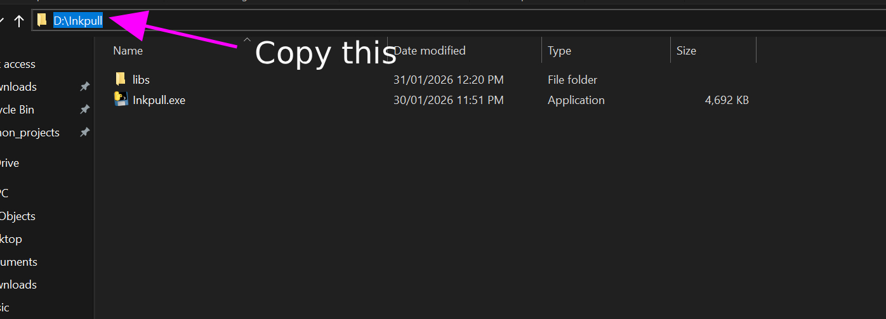
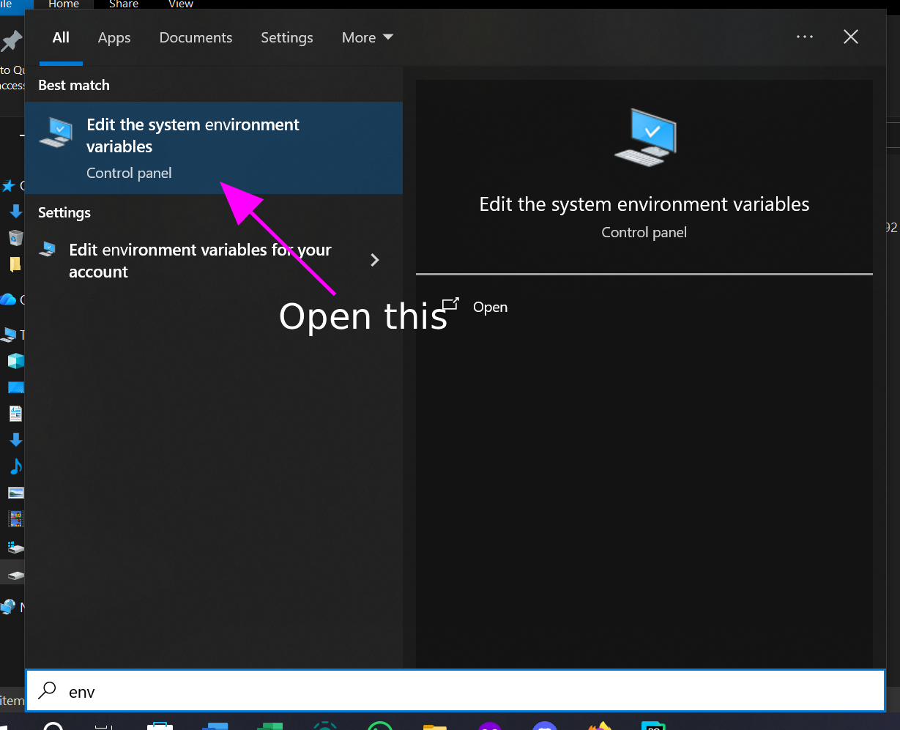
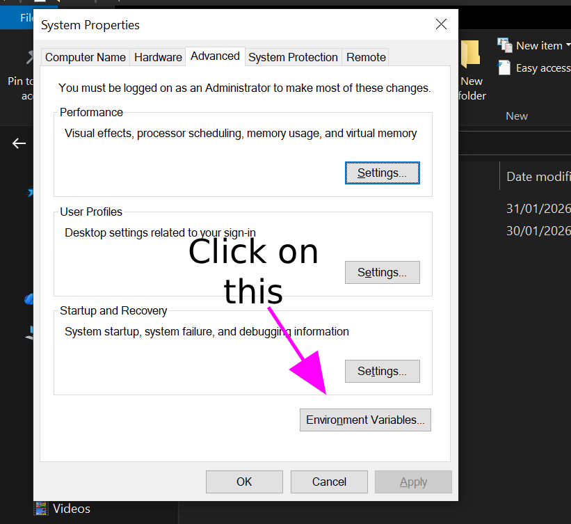
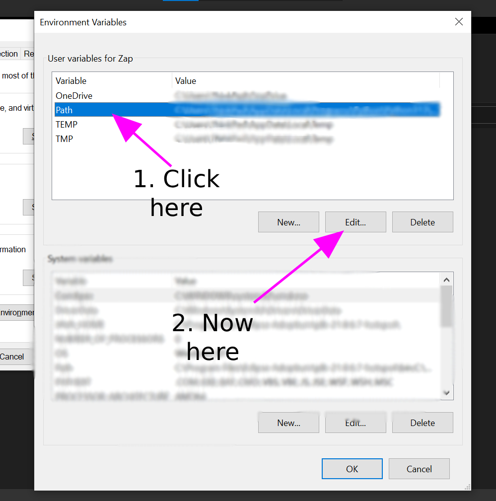
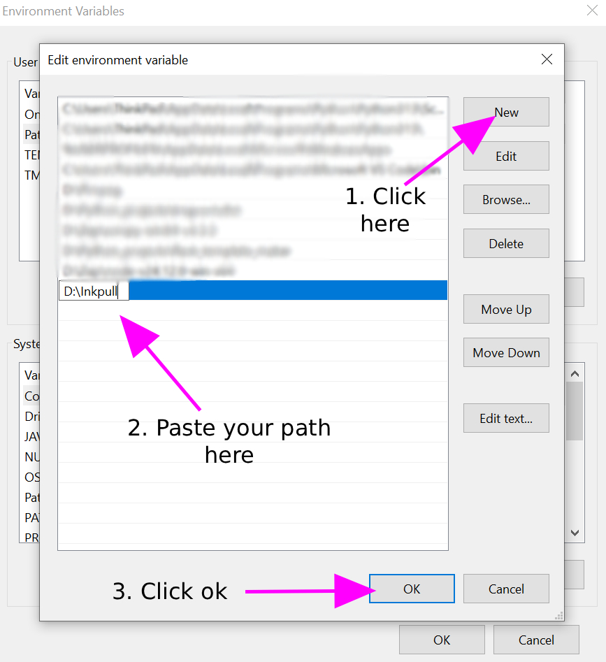

# Inkpull
A Comic downloader cli tool made with python

Currently supported [sites](docs/Site_Specific.md)

## How to install 

Download the latest version of Inkpull from the [release](https://github.com/Zap-09/Inkpull/releases) page

Unzip the file and put the exe and the `libs` folder somewhere that you don't need admin privileges. E.g. `D:/Your folder path/Inkpull.exe`

Copy the path where you put the files (e.g. `D:/Your folder path`) and add it to the PATH in System Environment Variables.

If you don't know how to add to PATH in System Environment Variables

 
Click here

 1. 
  
 2. 
  
 3. 
  
 4. 
  
 5. 
  
And you are done.

 

## How to use 

Open a command prompt or terminal and run:   `inkpull <sitename> <-flag> <url>`

Most of the sites follow this type of structure. If there are any caveats or special requirements, check the [site specific](docs/Site_Specific.md) flags in the documentation. 

## Configuration

By default, a config file will be created the first time the program is run at `config/config.json` next to the exe file. You can change its location by adding this key `inkpull_config` to your System Environment Variables with the value being where you want the file be.

If you want to edit the file you can run `inkpull --config` and it will open the file in your default text editor.

## Building the exe yourself

If you want to build this your self you can head over the [build](docs/Building.md) section.